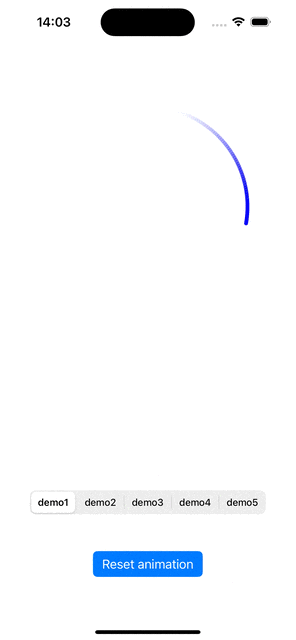

# ArcKit


ArcKit is a lightweight and flexible Swift library for creating animated arcs and circular visuals.
Ideal for building easily custom loaders, progress indicators, scanner-style or random UI components.


## ✨ Features

Draw and animate circular arcs or full rings

Customize radius, line width, colors, sweep angles, speed, acceleration, ...

Easy to integrate into any UIKit project

Built with Swift 
Zero dependencies

## 📸 Preview



## 🔧 Installation

Add ArcKit to your project via 

Swift Package Manager:
```ruby
https://git@github.com/BaptisteSansierra/ArcKit.git 
```

Cocoapods:
```ruby
pod 'UIArcKit'
```

Carthage:
```ruby
git "git@github.com:BaptisteSansierra/ArcKit.git"
```


## Usage

Create your own UIView inheriting from ArcTrialView and add some components inside, that's pretty it
```swift
public class MyOwnArcView: ArcTrialView {
    
    override public init(frame: CGRect) {
        super.init(frame: frame)
        // Add a spinning arc
        addArc(SpinningGradientArc(centerOffset: CGPoint.zero,
                                   radiusRate: 1,
                                   startAngle: -90,
                                   endAngle: 45,
                                   lineWidth: 3,
                                   colorTip: .red,
                                   colorFoot: .purple,
                                   colorInterp: .linear,
                                   alphaTip: 1,
                                   alphaFoot: 0,
                                   alphaInterp: .pow(x: 2),
                                   speed: 200,
                                   acc: 20,
                                   startPolicy: .progressive))
        addArc(InflatingCircle(centerOffset: CGPoint.zero,
                               radiusRateStart: 0.3,
                               radiusRateEnd: 1,
                               alphaStepGrowth: alphaStepGrowth,
                               alphaStepDecrease: alphaStepDecrease,
                               lineWidth: 1,
                               speed: speed,
                               delay: 0.2,
                               color: .gray))
    }
}
```

Then just start its animation
```swift
let myView = MyOwnArcView()
myView.startAnimating()
```

Have a look to trial views for more details.


## License

ArcKit is available under the MIT license. See the LICENSE file for more info.
